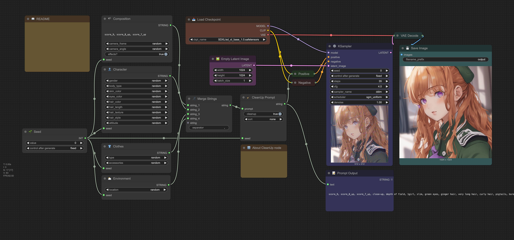

# ComfyUI Prompt Factory

A collection of [ComfyUI](https://github.com/comfyanonymous/ComfyUI) nodes that adds randomness to prompt generation.



## Installation

### Via ComfyUI

If you have [ComfyUI Manager](https://github.com/ltdrdata/ComfyUI-Manager) installed, you can simply import [`workflow.json`](workflow.json) or [`workflow.png`](workflow.png) in ComfyUI and click on "Install Missing Nodes".

Alternatively, you can install it via the [Comfy Registry](https://registry.comfy.org/publishers/satche/nodes/comfyui-prompt-factory) using the [CLI](https://docs.comfy.org/comfy-cli/getting-started#install-cli).

```shell
$ comfy node registry-install comfyui-prompt-factory
```

### Manually

Clone this repo in `custom_nodes` situated in your ComfyUI install folder.

```shell
$ git clone https://github.com/satche/comfyui-prompt-factory
$ pip install -r requirements.txt
```

## Usage

Select one or multiple nodes from the ⚙️`Prompt Factory` collection and adapt the settings.

Every node is created according to the [`config.json`](config.json) file, that can modify to add your own nodes.

## License

This project is licensed under the MIT License - see the [LICENSE](LICENSE) file for details.
